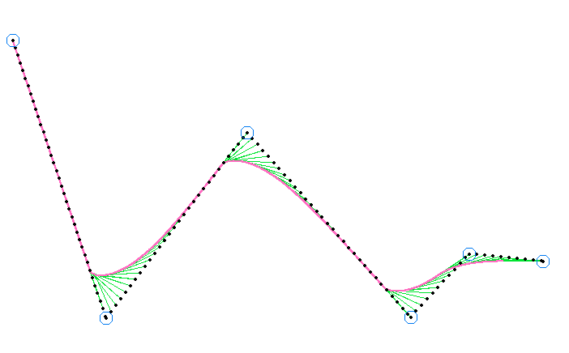

# Path Following Demo


This application is an interactive demonstration of the [Pure Pursuit](http://www.enseignement.polytechnique.fr/profs/informatique/Eric.Goubault/MRIS/coulter_r_craig_1992_1.pdf) algorithm used by [@frc5024](https://github.com/frc5024) in [frc5024/lib5k](https://github.com/frc5024/lib5k). The goals of this application are:

 - Provide an easy way to demonstrate the algorithm
 - Graphically display the quirks and imperfections
 - Help debug general error cases

The algorithm itself was originally a quick proof-of-concept that became production code. As such, there are some cases that one would expect to function in a specific way that actually end up doing something completely different. I describe this as a "greedy path search", meaning that any shortcuts that can be taken by the path follower **will** be taken.

## Running

```sh
git clone https://github.com/ewpratten/pathfollowing-demo
cd pathfollowing-demo
cargo run
```

Control points can be added by clicking the window, and everything can be reset by pressing `r`.

## Screenshots

